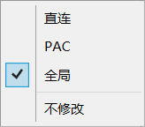
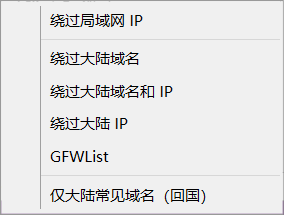
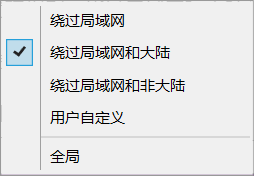

## ShadowsocksR(SSR)简单使用教程

### 一. 系统代理

- 直连：不使用代理上网，所有的上网流量都不会经过SSR
- PAC：依据PAC代理规则文件 pac.txt 进行自定义的上网流量分流
- **全局（默认）**：所有的上网流量都经过SSR
- 不修改：SSR不会修改电脑系统中的代理状态

### 二. 规则设置

#### 1. 更新PAC（详情见文末链接，新手可以不使用这个功能）

- 绕过局域网IP
- 绕过大陆域名和IP
- 绕过大陆IP（慎用）
- GFWList
- 仅大陆常见域名（回国）

#### 2. 代理规则

- **绕过局域网和大陆（默认）**：访问局域网和中国大陆的IP、域名不走代理，其他所有流量走代理。
- 绕过局域网
- 绕过局域网和非大陆
- 用户自定义：开发者已放弃更新，PAC更好用
- 全局：所有通过SSR的流量全部走代理连接

### 三. 简单使用
1. ==SSR初始默认代理设置（可满足大部分用户需求）：==
- 系统代理：全局
- 代理规则：绕过局域网和大陆
  
2. 使用心得
- 日常使用，使用**全局**和**绕过局域网和大陆**的组合即可，不需要使用PAC
- 不需要使用代理的时候，可以将全局改为**直连**，节省流量
- PAC模式是高阶的玩法，优点：用户可以灵活配置、节省节点流量、保证大部分国外网站的网速，个人不是专业人士，有需要的可以参考文末的链接

---
记录学习，侵权删
> 参考资料，上述内容从下面的链接中摘取：https://baiyunju.cc/8526
> 
> https://baiyunju.cc/8508
> 
> https://baiyunju.cc/8518

  

