# vscode使用ssh密钥连接github

## 流程
1. 生成ssh密钥对
2. 配置github公钥
   
### 一. 生成ssh密钥对
1. 创建密钥对：打开`git bash`，输入`ssh-keygen`。
2. 我这里之前创建过密钥对，所以会询问我是否覆盖，为了演示，输入`y`。
3. Enter passphrase：个人学习的话，建议直接回车（设置为空），不然后期`git push`的时候会一直让你输入这个passphrase，比较麻烦。
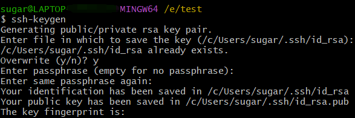

- 密钥的位置：`C:\Users\sugar\.ssh`，sugar换成你自己的用户名
- 私钥：`id_rsa`
- 公钥：`id_rsa.pub`（需要配置到github账户中）

### 二. 配置github公钥
1. 登录自己的github：`settings -> SSH and GPG keys -> NEW SSH key`。
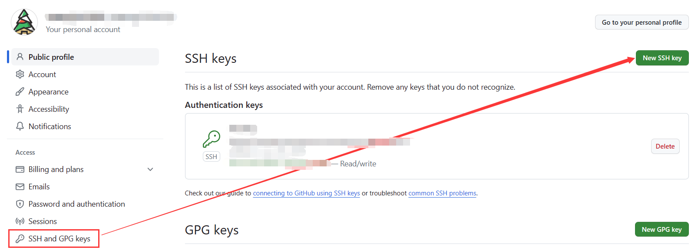

1. 填写`Title`，然后将`id_rsa.pub`的内容粘贴到`Key`中。
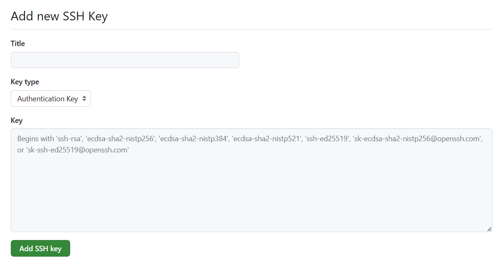

### 三. 测试连接github
1. 创建一个test文件夹，里面写一个`test.md`文件，用于测试。

2. 将`test.md`在vscode中打开，在terminal开启git bash，输入`ssh -T git@github.com`，测试密钥是否正常。
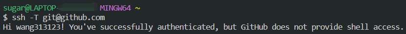

### 四. vscode中提交代码到github
1. 打开test文件夹`Open Folder`
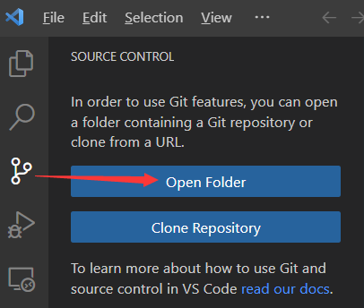

2. 初始化仓库`Initialize Reposiroty`
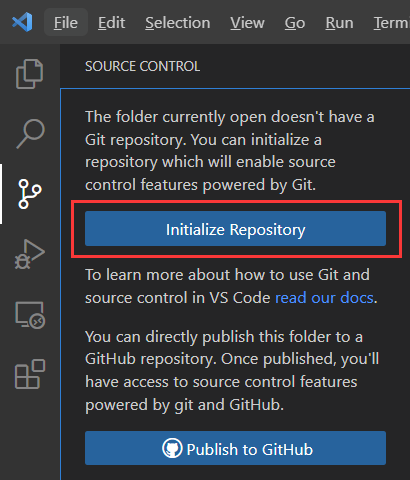

3. `git add`：点击加号
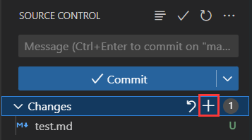

4. `git commit`：填写Message后，点击commit
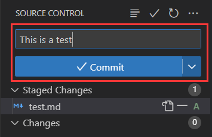

5. `git push`：点击publish
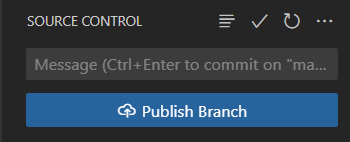

- **`git push`可能遇到的问题**：
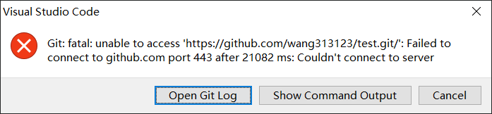

- 解决办法：
  - 打开项目的.git文件中的`config`
 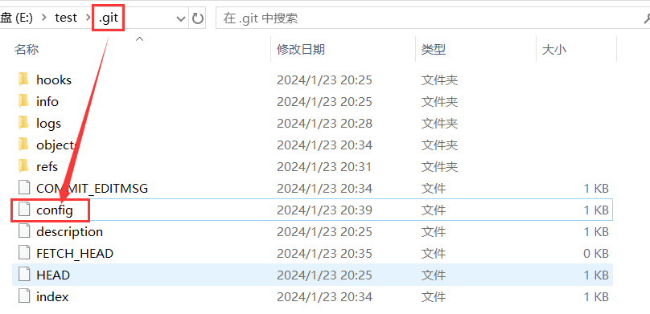

  - 修改url为ssh（我这里已经修改了）
 

  - ssh在github中的位置
 

---
仅记录学习，侵权删
> 参考资料：
> https://www.bilibili.com/video/BV1dV411G77N/?spm_id_from=333.337.search-card.all.click&vd_source=f9d56e10b04f22c90b9ca7af319c45b0
> https://blog.csdn.net/weixin_42703267/article/details/120464357
> https://code.visualstudio.com/docs/sourcecontrol/overview#_working-in-a-git-repository